# 👜 Valentique Luxe Bag Store

A premium e-commerce platform for luxury bags, built with the **MERN Stack** (MongoDB, Express, React, Node.js). This application features a modern, responsive UI with secure authentication, admin product management, and a seamless shopping experience.

🔗 **Live Demo:** [https://valentique-luxe-bag-store.vercel.app](https://valentique-luxe-bag-store.vercel.app)  
🔌 **Backend API:** [https://valentique-api.onrender.com](https://valentique-api.onrender.com)

---

## ✨ Features

### 👤 User Features
* **Authentication:** Secure Login & Registration (JWT-based).
* **Checkout:** Payment gateway integration through Razorpay API.
* **Product Browsing:** Filter products by category, price, brand, and material.
* **Search:** Real-time search functionality.
* **Shopping Cart:** Add/remove items, adjust quantities, and view totals.
* **Wishlist:** Save favorite items for later.
* **Order Management:** Place orders and view order history.
* **Responsive Design:** Fully optimized for mobile and desktop using Tailwind CSS.

### 🛡️ Admin Features
* **Dashboard:** Overview of store performance.
* **Product Management:** Create, Read, Update, and Delete (CRUD) products.
* **Order Management:** View all orders.
* **Image Handling:** Upload and preview product images.
* **User Management:** View registered users.

---

## 📸 Screenshots

<table>
  <tr>
    <td><b>Home</b></td>
    <td><b>Products</b></td>
  </tr>
  <tr>
    <td></td>
    <td>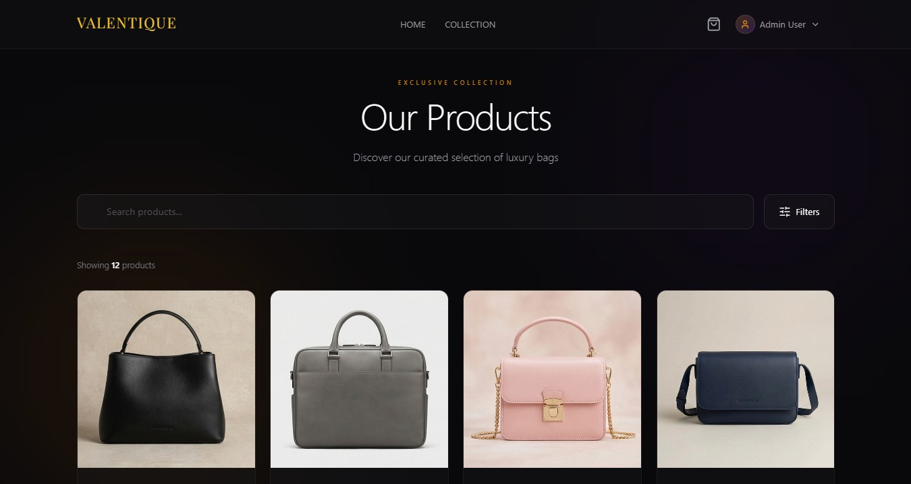</td>
  </tr>

  <tr>
    <td><b>Product Details</b></td>
    <td><b>Cart</b></td>
  </tr>
  <tr>
    <td>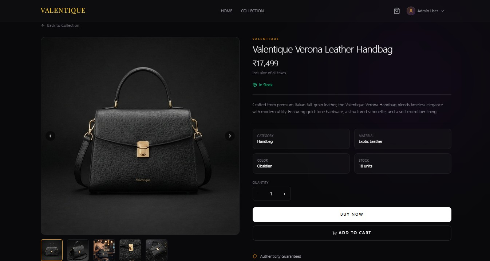</td>
    <td>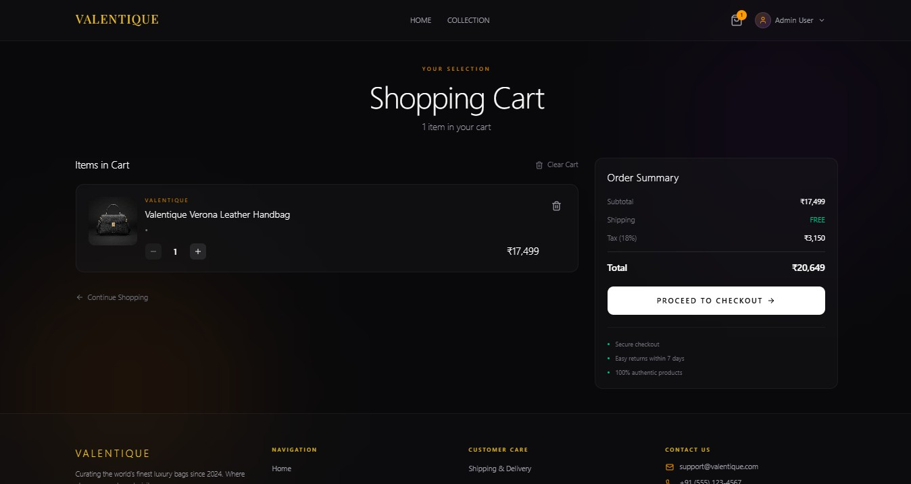</td>
  </tr>

  <tr>
    <td><b>Checkout</b></td>
    <td><b>Login</b></td>
  </tr>
  <tr>
    <td>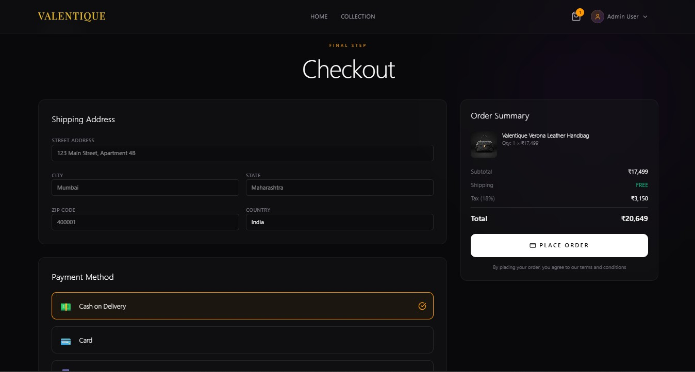</td>
    <td>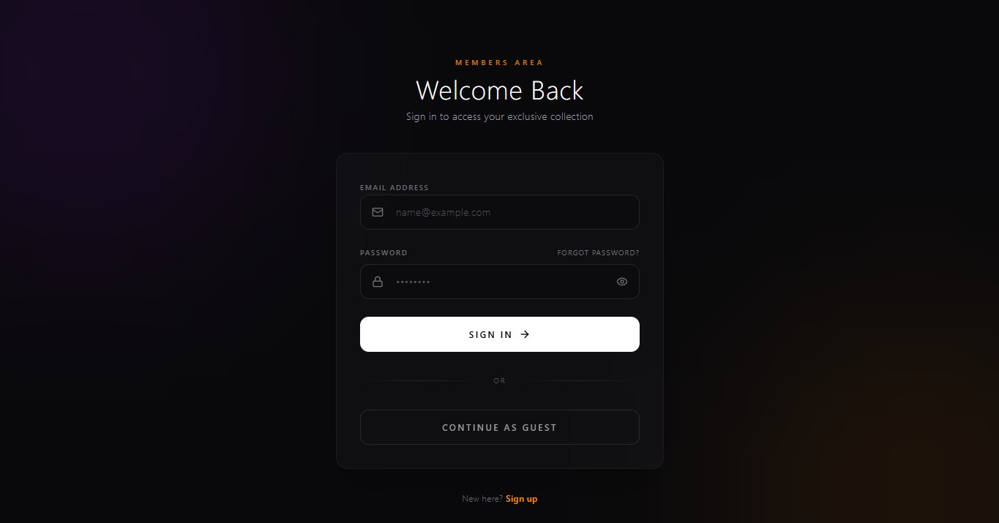</td>
  </tr>

  <tr>
    <td><b>Register</b></td>
    <td><b>User Profile</b></td>
  </tr>
  <tr>
    <td>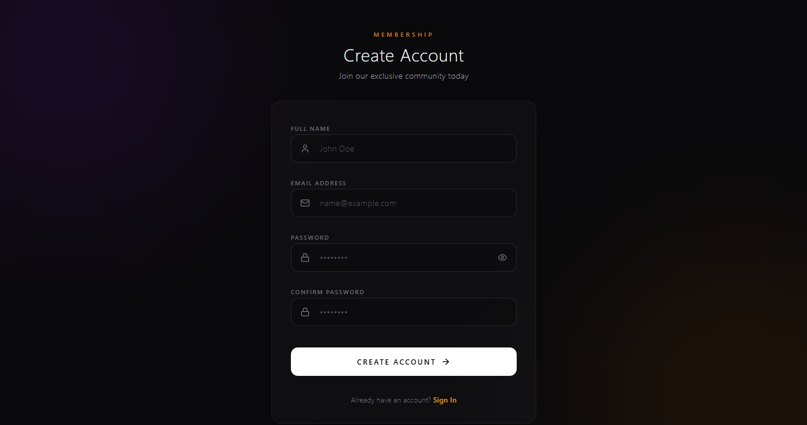</td>
    <td>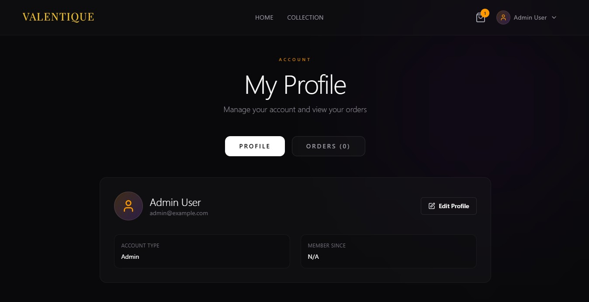</td>
  </tr>

  <tr>
    <td><b>Admin Dashboard</b></td>
    <td><b>Admin Product Management</b></td>
  </tr>
  <tr>
    <td>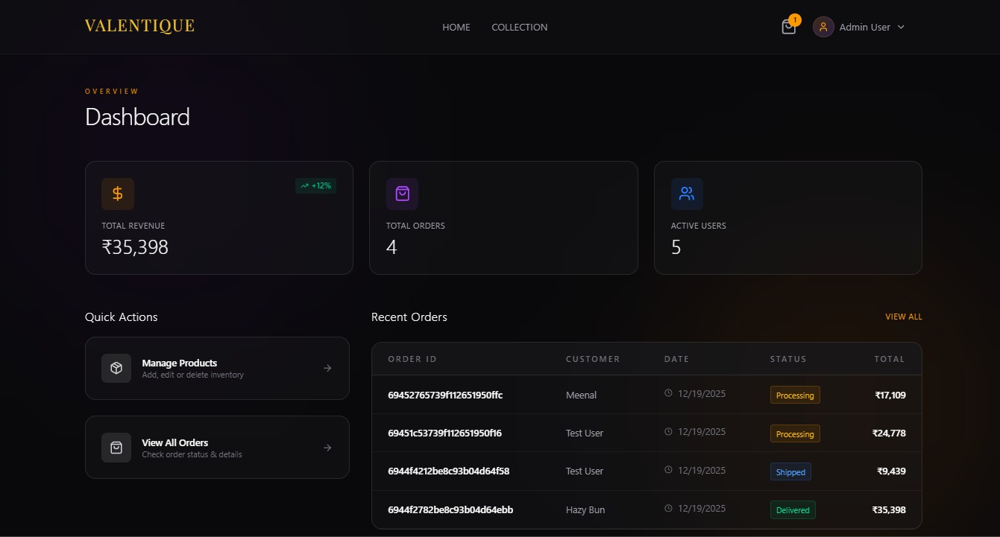</td>
    <td>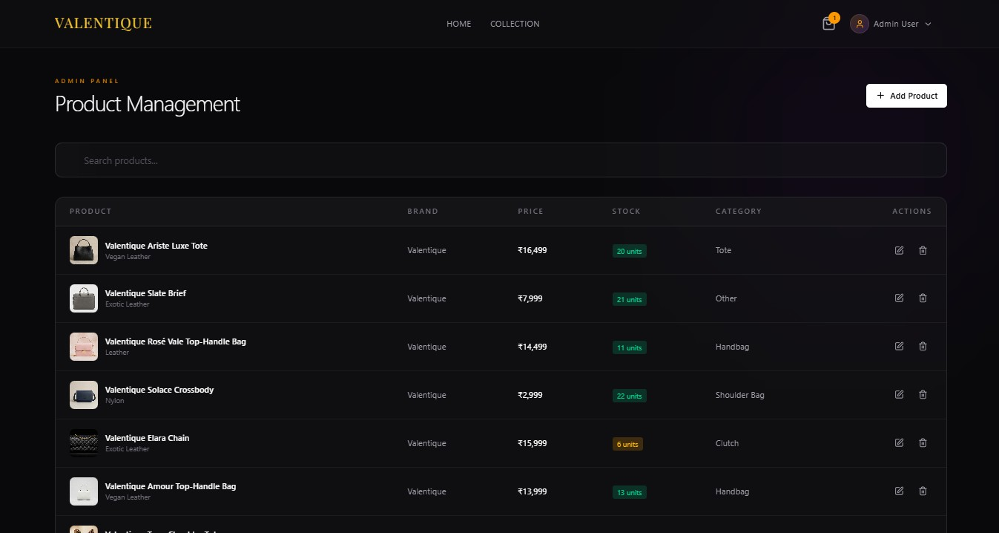</td>
  </tr>

  <tr>
    <td><b>Admin Order Management</b></td>
    <td><b>Products View (Alt)</b></td>
  </tr>
  <tr>
    <td>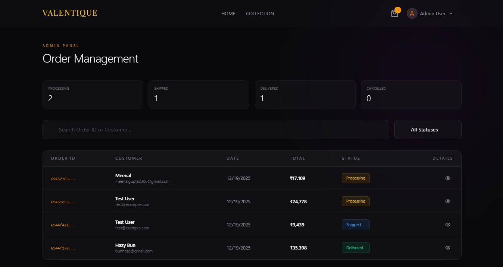</td>
    <td>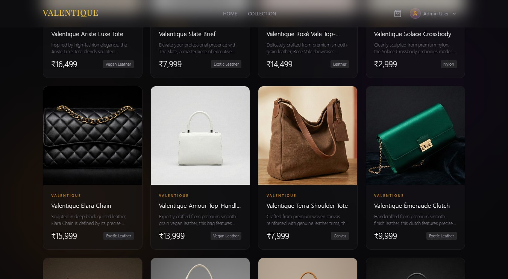</td>
  </tr>
</table>

---

## 🛠️ Tech Stack

### Frontend
* **React:** UI Library (Vite).
* **Tailwind CSS:** Styling.
* **Framer Motion:** Animations and transitions.
* **Lucide React:** Icons.
* **Axios:** HTTP requests.

### Backend
* **Node.js & Express:** Server runtime and framework.
* **MongoDB & Mongoose:** Database and ODM.
* **Multer:** File uploads.
* **JWT (JSON Web Tokens):** Authentication security.
* **Bcrypt:** Password hashing.
* **Cloudinary:** Upload images.

### Deployment
* **Frontend:** Vercel
* **Backend:** Render

---

## 🚀 Getting Started

Follow these steps to run the project locally on your machine.

### Prerequisites
* Node.js (v14 or higher)
* MongoDB (Local or Atlas URL)
* Git

### 1. Clone the Repository
```bash
git clone https://github.com/ys09123/valentique-luxe-bag-store.git
cd valentique-luxe-bag-store
```

### 2. Backend Setup
Navigate to the backend folder and install dependencies:
```bash
cd backend
npm install
```
Create a .env file in the backend folder and add:
* PORT=5000
* MONGO_URI=your_mongodb_connection_string
* JWT_SECRET=your_jwt_secret_key
* JWT_EXPIRE=3650d

Start the backend server:
```bash
npm run dev
```
### 3. Frontend Setup

Open a new terminal, navigate to the frontend folder, and install dependencies:
```bash
cd frontend
npm install
```

Create a src/config.js (or .env file) for configuration:
* export const API_URL = "http://localhost:5000";

Start the frontend development server:
```bash
npm run dev
```

---

## 📂 Project Structure
```
valentique-luxe-bag-store/
├── backend/
│   ├── controllers/    # Route logic
│   ├── config/         # Database logic
│   ├── utils/          # Generate token
│   ├── models/         # Mongoose schemas
│   ├── routes/         # API endpoints
│   ├── middleware/     # Auth & Upload middleware
│   ├── uploads/        # Local image storage
│   └── server.js       # Entry point
│
└── frontend/
    ├── src/
    │   ├── components/ # Reusable UI components
    │   │   ├── cart/
    │   │   ├── common/
    │   │   ├── layout/
    │   │   ├── product/
    │   │   ├── ui/
    │   ├── public/     # Used to store public assets
    │   ├── pages/      # Full page views
    │   │   ├── admin/
    │   ├── context/    # Global state (Auth, Cart, Toast)
    │   ├── lib/
    │   ├── services/   # API calls
    │   └── config.js   # Configuration
    ├── index.html
    ├── App.css
    ├── App.jsx         # Entry point
    ├── vite.config.js  # Vite configuration
    └── main.jsx
```

---

## 📡 API Endpoints
```
Method	                    Endpoint	                Description
POST	                    /api/auth/register	        Register a new user
POST	                    /api/auth/login	            Login user & get token
GET	                        /api/products	            Get all products (with filters)
GET	                        /api/products/:id	        Get single product details
POST	                    /api/products	            Create a product (Admin only)
PUT	                        /api/products/:id	        Update a product (Admin only)
DELETE	                    /api/products/:id	        Delete a product (Admin only)
POST	                    /api/cart	                Add item to cart
GET                         /api/profile                Display user profile
GET                         /api/admin/dashboard        Admin dashboard
GET                         /api/admin/orders           Admin order management
POST                        /api/admin/products         Admin product management
POST	                    /api/orders	                Create a new order
```

---

## 🤝 Contributing
* Contributions are welcome!
* 1. Fork the project.
* 2. Create your feature branch.
*         (git checkout -b feature/AmazingFeature)
* 3. Commit your changes.
*         (git commit -m 'Add some AmazingFeature')
* 4. Push to the branch.
*         (git push origin feature/AmazingFeature)
* 5. Open a Pull Request.

---

## 📝 License
* Distributed under the MIT License. See LICENSE for more information.

---

<p align="center"> Built with ❤️ by Yash </p>


