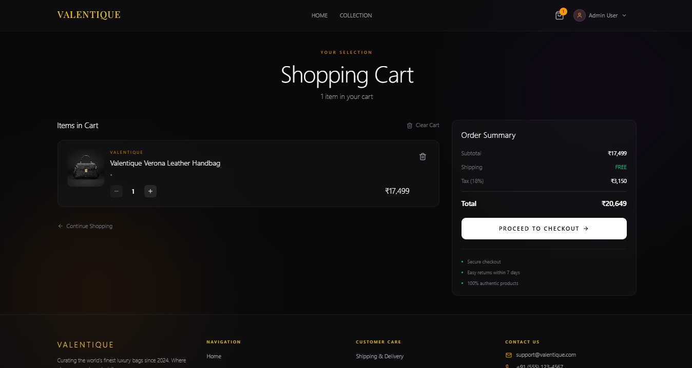
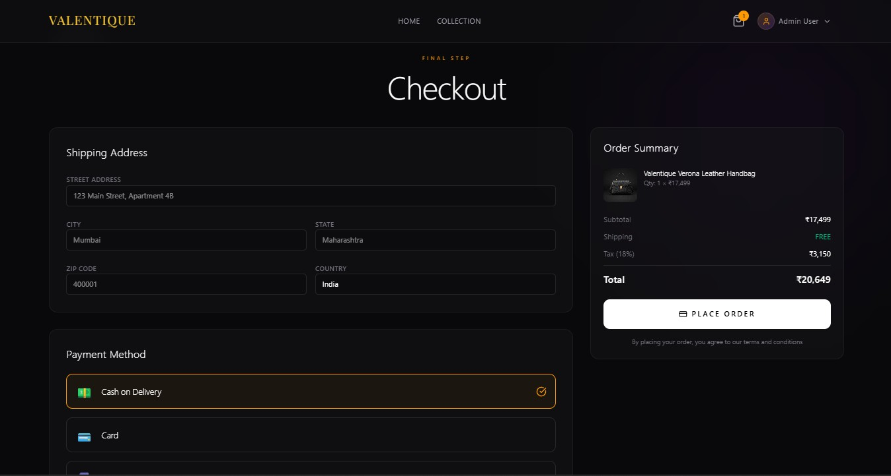
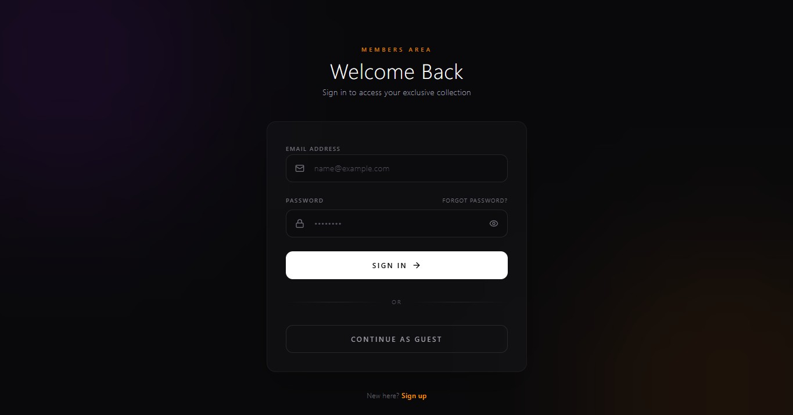
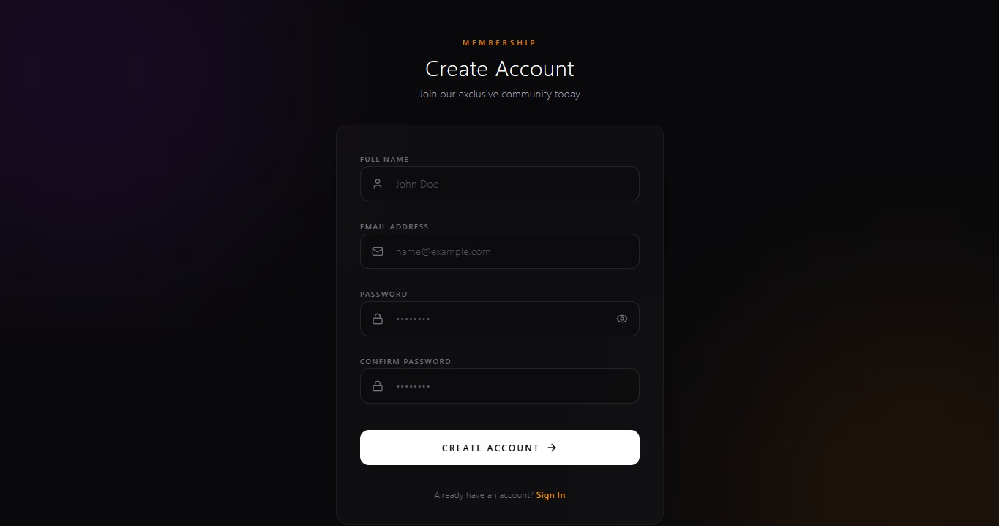
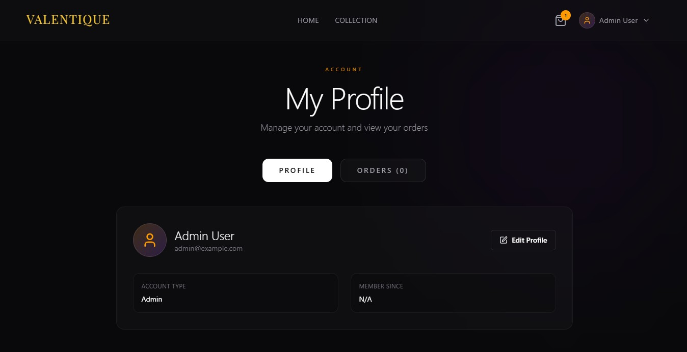
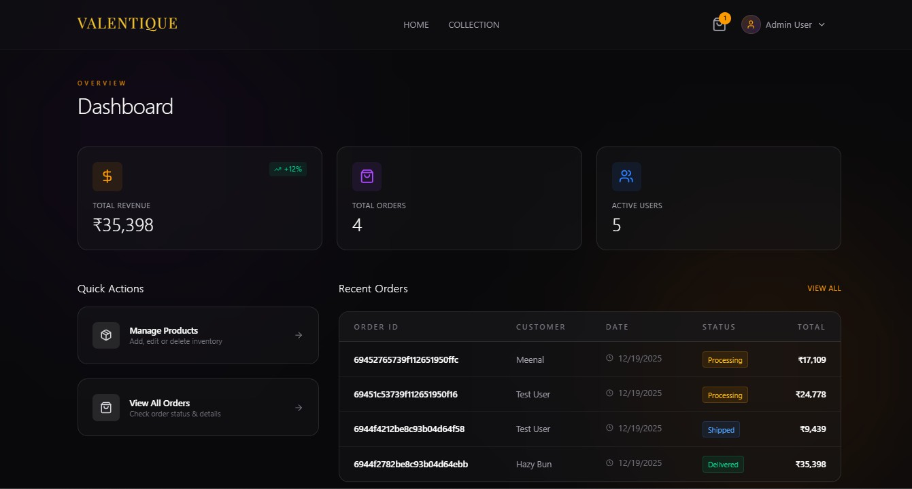
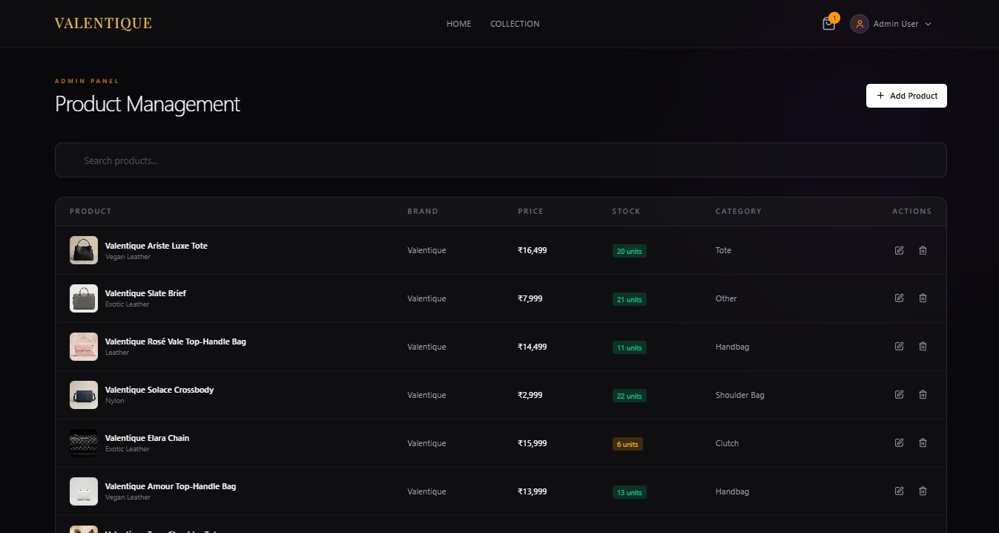
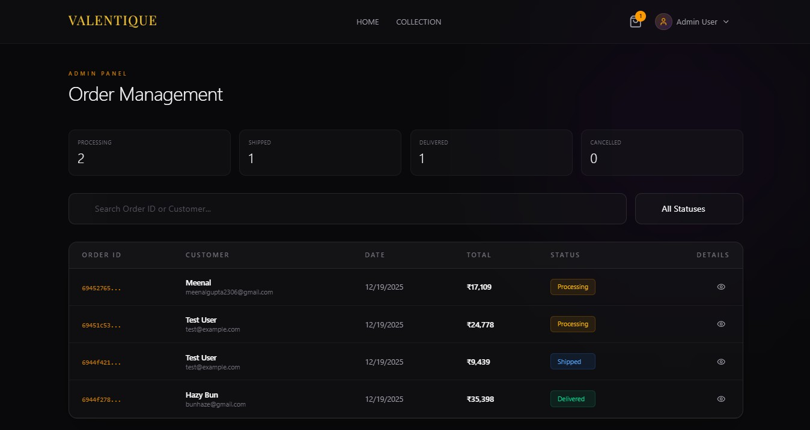

# 👜 Valentique Luxe Bag Store

A premium e-commerce platform for luxury bags, built with the **MERN Stack** (MongoDB, Express, React, Node.js). This application features a modern, responsive UI, secure authentication, admin product management, Razorpay checkout, and an **AI-powered shopping assistant** with semantic product search.

🔗 **Live Demo:** [https://valentique-luxe-bag-store.vercel.app](https://valentique-luxe-bag-store.vercel.app)
🔌 **Backend API:** [https://valentique-api.onrender.com](https://valentique-api.onrender.com)

---

## ✨ Features

### 👤 User Features
* **Authentication:** Secure Login & Registration (JWT-based).
* **Checkout:** Payment gateway integration through Razorpay API (order creation + signature verification).
* **Product Browsing:** Filter products by category, price, brand, and material.
* **Search:** Real-time search functionality.
* **AI Shopping Assistant:** Conversational chat widget that understands natural-language queries (e.g. "show me a black leather tote under ₹15,000") and recommends products, powered by Google Gemini with retrieval-augmented generation.
* **Shopping Cart:** Add/remove items, adjust quantities, and view totals.
* **Wishlist:** Save favorite items for later.
* **Order Management:** Place orders and view order history.
* **Responsive Design:** Fully optimized for mobile and desktop using Tailwind CSS.

### 🛡️ Admin Features
* **Dashboard:** Overview of store performance and stats.
* **Product Management:** Create, Read, Update, and Delete (CRUD) products.
* **Order Management:** View all orders and update order status.
* **User Management:** View, manage roles for, and delete registered users.
* **Image Handling:** Upload and preview product images (Cloudinary-backed, with local `uploads/` fallback).

### 🤖 AI / Semantic Search
* **Retrieval-Augmented Chat:** `/api/ai/chat` retrieves relevant products and passes them as context to Gemini to generate grounded, conversational recommendations.
* **Semantic Search via ChromaDB:** Product embeddings are generated with Gemini and stored in ChromaDB for vector similarity search, with automatic price-range filtering parsed from natural language ("under 5000", "above 15k", "affordable", "luxury", etc.).
* **Graceful Fallback:** If ChromaDB is unavailable, the assistant automatically falls back to a MongoDB keyword/category/material/color search so the feature degrades gracefully instead of failing.
* **Conversation Memory:** Chat history is tracked per `conversationId`, with an endpoint to clear a conversation.
* **Embedding Seed Script:** `scripts/seedEmbeddings.js` backfills embeddings for all existing products into ChromaDB.

---

## 📸 Screenshots

<table>
  <tr>
    <td><b>Home</b></td>
    <td><b>Products</b></td>
  </tr>
  <tr>
    <td></td>
    <td></td>
  </tr>

  <tr>
    <td><b>Product Details</b></td>
    <td><b>Cart</b></td>
  </tr>
  <tr>
    <td></td>
    <td></td>
  </tr>

  <tr>
    <td><b>Checkout</b></td>
    <td><b>Login</b></td>
  </tr>
  <tr>
    <td></td>
    <td></td>
  </tr>

  <tr>
    <td><b>Register</b></td>
    <td><b>User Profile</b></td>
  </tr>
  <tr>
    <td></td>
    <td></td>
  </tr>

  <tr>
    <td><b>Admin Dashboard</b></td>
    <td><b>Admin Product Management</b></td>
  </tr>
  <tr>
    <td></td>
    <td></td>
  </tr>

  <tr>
    <td><b>Admin Order Management</b></td>
    <td><b>Products View (Alt)</b></td>
  </tr>
  <tr>
    <td></td>
    <td></td>
  </tr>
</table>

---

## 🛠️ Tech Stack

### Frontend
* **React 19:** UI Library (Vite 7).
* **Tailwind CSS 4:** Styling.
* **Framer Motion:** Animations and transitions.
* **Lucide React / React Icons:** Icons.
* **Radix UI + class-variance-authority + tailwind-merge:** Accessible, composable UI primitives (`components/ui`).
* **React Router 7:** Client-side routing.
* **Axios:** HTTP requests.
* **Vercel Analytics.**

### Backend
* **Node.js & Express:** Server runtime and framework (ESM).
* **MongoDB & Mongoose:** Primary database and ODM.
* **ChromaDB:** Vector database for semantic product search.
* **Google Gemini (`@google/genai`):** Embeddings + conversational AI shopping assistant.
* **Razorpay:** Payment order creation and signature verification.
* **Multer + multer-storage-cloudinary:** File uploads.
* **Cloudinary:** Product image hosting.
* **JWT (JSON Web Tokens):** Authentication.
* **Bcrypt.js:** Password hashing.

### Deployment
* **Frontend:** Vercel (Docker image also available, served via Nginx).
* **Backend:** Render (Docker image also available).
* **Docker Compose:** `docker-compose.yml` spins up the backend, frontend, and a ChromaDB container together for a full local/self-hosted stack.

---

## 🚀 Getting Started

Follow these steps to run the project locally on your machine.

### Prerequisites
* Node.js (v20 or higher recommended)
* MongoDB (Local or Atlas URL)
* Git
* (Optional, for AI features) A Google Gemini API key and a running ChromaDB instance
* (Optional) Docker & Docker Compose, if you prefer running the full stack in containers

### 1. Clone the Repository
```bash
git clone https://github.com/ys09123/valentique-luxe-bag-store.git
cd valentique-luxe-bag-store
```

### 2. Backend Setup
Navigate to the backend folder and install dependencies:
```bash
cd backend
npm install
```
Create a `.env` file in the `backend` folder and add:
```
PORT=5000
NODE_ENV=development
MONGO_URI=your_mongodb_connection_string
JWT_SECRET=your_jwt_secret_key
JWT_EXPIRE=3650d

# Cloudinary (product image uploads)
CLOUDINARY_CLOUD_NAME=your_cloudinary_cloud_name
CLOUDINARY_API_KEY=your_cloudinary_api_key
CLOUDINARY_API_SECRET=your_cloudinary_api_secret

# Razorpay (checkout)
RAZORPAY_KEY_ID=your_razorpay_key_id
RAZORPAY_KEY_SECRET=your_razorpay_key_secret

# AI Shopping Assistant (optional but required for /api/ai/chat)
GEMINI_API_KEY=your_gemini_api_key
CHROMA_URL=http://localhost:8000
```

Start the backend server:
```bash
npm run dev
```

#### (Optional) Enable the AI Shopping Assistant
The AI assistant works best with semantic search backed by ChromaDB. If ChromaDB isn't running or reachable, the assistant automatically falls back to MongoDB keyword search — no extra setup required.

To enable full semantic search:
```bash
# Start a local ChromaDB instance
docker run -d -p 8000:8000 --name chromadb chromadb/chroma

# Seed product embeddings into ChromaDB
npm run seed:embeddings

# Or reset the collection and re-seed from scratch
npm run seed:embeddings:reset
```

### 3. Frontend Setup

Open a new terminal, navigate to the frontend folder, and install dependencies:
```bash
cd frontend
npm install
```

Create a `src/config.js` (or `.env` file) for configuration:
```js
export const API_URL = "http://localhost:5000";
```

Start the frontend development server:
```bash
npm run dev
```

### 4. Run with Docker Compose (alternative)
To run the backend, frontend, and ChromaDB together without installing Node locally:
```bash
# Make sure backend/.env is populated as described above
docker compose up -d
```
This starts:
* `backend` on `http://localhost:5000`
* `frontend` on `http://localhost:5173`
* `chroma` (ChromaDB) on `http://localhost:8000`

---

## 📂 Project Structure
```
valentique-luxe-bag-store/
├── docker-compose.yml   # Runs backend + frontend + ChromaDB together
├── backend/
│   ├── controllers/    # Route logic (auth, product, cart, order, admin, ai)
│   ├── config/         # Database connection logic
│   ├── middleware/     # Auth & upload middleware
│   ├── models/         # Mongoose schemas (User, Product, Cart, Order)
│   ├── routes/         # API endpoints
│   ├── services/       # Gemini AI, embeddings, ChromaDB vector store
│   ├── scripts/        # seedEmbeddings.js, benchmark.js
│   ├── uploads/         # Local image storage (fallback if Cloudinary isn't configured)
│   ├── Dockerfile
│   └── server.js       # Entry point
│
└── frontend/
    ├── src/
    │   ├── components/ # Reusable UI components
    │   │   ├── ai/      # AI chat widget, chat window, messages, suggestions
    │   │   ├── cart/
    │   │   ├── common/
    │   │   ├── layout/
    │   │   ├── ui/      # Radix-based primitives (button, input, label)
    │   ├── pages/      # Full page views
    │   │   ├── admin/  # Dashboard, ProductManagement, OrderManagement
    │   ├── context/    # Global state (Auth, Cart, Toast)
    │   ├── lib/
    │   ├── services/   # API calls
    │   └── config.js   # Configuration
    ├── Dockerfile
    ├── nginx.conf
    ├── index.html
    ├── App.jsx         # Entry point
    ├── vite.config.js  # Vite configuration
    └── main.jsx
```

---

## 📡 API Endpoints

### Auth — `/api/auth`
| Method | Endpoint | Access | Description |
|---|---|---|---|
| POST | `/api/auth/register` | Public | Register a new user |
| POST | `/api/auth/login` | Public | Login user & get JWT |
| GET | `/api/auth/profile` | Private | Get logged-in user's profile |
| PUT | `/api/auth/profile` | Private | Update logged-in user's profile |

### Products — `/api/products`
| Method | Endpoint | Access | Description |
|---|---|---|---|
| GET | `/api/products` | Public | Get all products (with filters) |
| GET | `/api/products/featured` | Public | Get featured products |
| GET | `/api/products/:id` | Public | Get single product details |
| POST | `/api/products` | Admin | Create a product (with image upload) |
| PUT | `/api/products/:id` | Admin | Update a product (with image upload) |
| DELETE | `/api/products/:id` | Admin | Delete a product |

### Cart — `/api/cart` (all routes require authentication)
| Method | Endpoint | Description |
|---|---|---|
| GET | `/api/cart` | Get the current user's cart |
| POST | `/api/cart` | Add an item to the cart |
| PUT | `/api/cart/:itemId` | Update an item's quantity |
| DELETE | `/api/cart/:itemId` | Remove an item from the cart |
| DELETE | `/api/cart/clear` | Clear the entire cart |

### Orders — `/api/orders`
| Method | Endpoint | Access | Description |
|---|---|---|---|
| POST | `/api/orders` | Private | Create a new order |
| GET | `/api/orders/myorders` | Private | Get the logged-in user's orders |
| GET | `/api/orders/:id` | Private | Get a single order by ID |
| GET | `/api/orders` | Admin | Get all orders |
| PUT | `/api/orders/:id/status` | Admin | Update an order's status |

### Admin — `/api/admin` (all routes require admin authentication)
| Method | Endpoint | Description |
|---|---|---|
| GET | `/api/admin/stats` | Get dashboard statistics |
| GET | `/api/admin/users` | List all registered users |
| DELETE | `/api/admin/users/:id` | Delete a user |
| PUT | `/api/admin/users/:id/role` | Update a user's role |

### Payments — `/api/payment`
| Method | Endpoint | Description |
|---|---|---|
| POST | `/api/payment/create-order` | Create a Razorpay order |
| POST | `/api/payment/verify-payment` | Verify a Razorpay payment signature |

### AI Shopping Assistant — `/api/ai`
| Method | Endpoint | Description |
|---|---|---|
| POST | `/api/ai/chat` | Send a message to the AI assistant; returns a response plus recommended products (semantic search via ChromaDB, or MongoDB keyword fallback) |
| DELETE | `/api/ai/chat/:conversationId` | Clear a conversation's chat history |

---

## 🤝 Contributing
* Contributions are welcome!
* 1. Fork the project.
* 2. Create your feature branch.
*         (git checkout -b feature/AmazingFeature)
* 3. Commit your changes.
*         (git commit -m 'Add some AmazingFeature')
* 4. Push to the branch.
*         (git push origin feature/AmazingFeature)
* 5. Open a Pull Request.

---

## 📝 License
* Distributed under the MIT License. See LICENSE for more information.

---

<p align="center"> Built with ❤️ by Yash </p>
